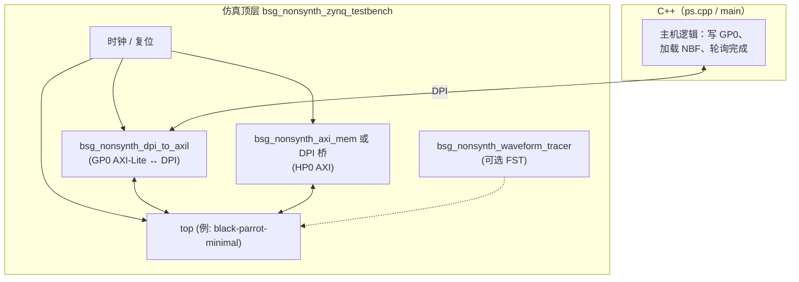
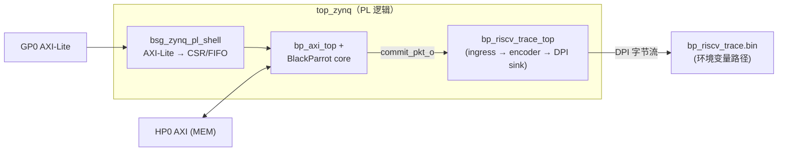
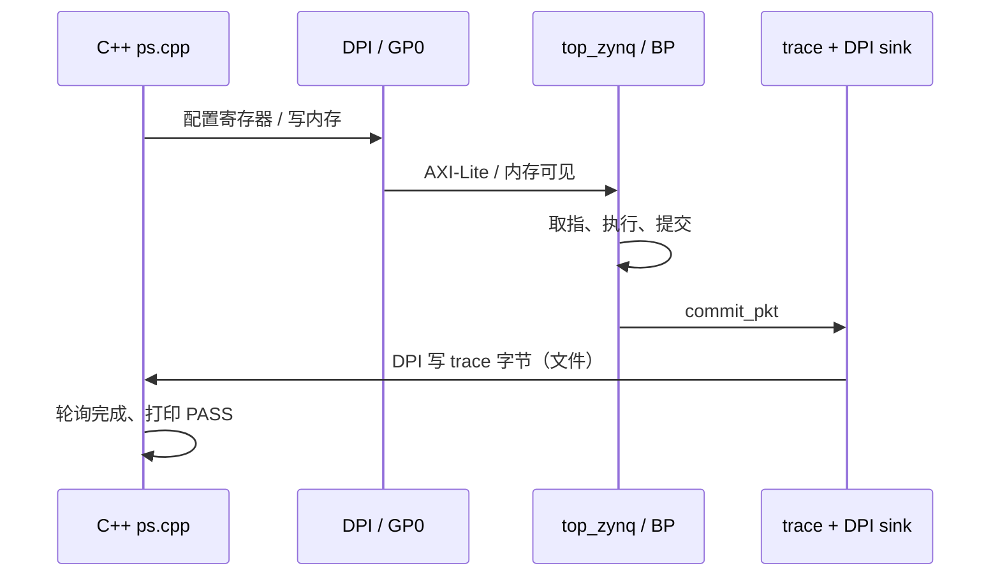

# ZynqParrot 基础设施说明（Cosim / 示例布局）

本文档面向 **proposal / mentor 汇报**：说明 [ZynqParrot](https://github.com/black-parrot-hdk/zynq-parrot) 在 **Co-Simulation** 路径下的典型结构，以及与 **black-parrot-minimal-example**、本仓库 **RISC-V trace** 接线的关系。图中层次与上游仓库一致；地址与位宽以 minimal 默认配置为例（可随 `Makefile` 变化）。

**English one-liner:** ZynqParrot unifies **PL (Verilog) + PS (C++)** under one build system; in Verilator cosim, the PS is emulated by **C++ + DPI** driving **AXI-Lite (GP0)** and optional **AXI (HP0)** memory, while `top` / `top_zynq` wraps the user design (here: BlackParrot + trace).

### 本文中的图（共 3 张，均已写入下方 Mermaid）

| 序号  | 位置   | 内容                                                        |
| --- | ---- | --------------------------------------------------------- |
| 图 1 | §3 末 | Testbench 内 **GP0 DPI、HP0 内存、`top`、波形** 与 **C++** 的关系（块图） |
| 图 2 | §4 末 | `**top_zynq` 内** shell、BlackParrot、**trace → 文件**（PL 数据流） |
| 图 3 | §5 末 | **C++ ↔ DPI ↔ PL ↔ trace** 的时序/序列示意                       |

导出 PNG/SVG：将对应代码块粘贴到 [Mermaid Live Editor](https://mermaid.live)。

---

## 1. 设计目标（ZynqParrot 在解决什么问题）

- **同一套「示例」目录** 可对接多种 **后端**：`verilator`、`vcs`、`vivado`（综合/比特流）、`zynq`（板上 PS 共仿）。
- **PL（可编程逻辑）** 与 **PS（处理器系统）** 的交互抽象成标准 **AXI / AXI-Lite** 端口；仿真时用 **DPI** 把 PS 侧行为接到 C++，板上则用真实 ARM。
- 新 IP 或新处理器（如 BlackParrot）通过 `**top` / `top_zynq`** 接入上述端口，而不必重写整个 testbench。

---

## 2. 示例目录结构（每个 `cosim/*-example`）

上游约定（见 `zynq-parrot/cosim/README.md`）：

| 文件/目录                                 | 作用                                      |
| ------------------------------------- | --------------------------------------- |
| `Makefile.collateral`                 | 运行所需附属物（如 NBF、内存镜像路径）                   |
| `Makefile.design`                     | 本设计的 C++ 源、`RUN_ARGS`、设计名等              |
| `Makefile.hardware`                   | Verilog 文件列表、宏、`VSOURCES`               |
| `ps.cpp` / `ps.hpp`                   | **PS 侧** 共仿/共仿逻辑：寄存器访问、加载程序、轮询          |
| `v/top.v`                             | 与 Zynq **端口名一致** 的顶层封装（例化 `top_zynq` 等） |
| `v/top_zynq.sv`                       | **用户 PL 设计**：BlackParrot、自定义 IP、trace 等 |
| `verilator/`、`vcs/`、`vivado/`、`zynq/` | 各后端入口，`make build` / `make run`         |

---

## 3. Co-Simulation 顶层层次（Verilator）

Testbench 顶层为 `**bsg_nonsynth_zynq_testbench`**（`cosim/v/bsg_nonsynth_zynq_testbench.sv`），主要职责：

1. 生成 `**aclk` / `aresetn**`。
2. **GP0（AXI-Lite）**：经 `**bsg_nonsynth_dpi_to_axil`** 与 C++ 侧 **DPI** 相连，模拟 PS 对 PL 的 **控制寄存器 / 小包配置** 访问。
3. **HP0（AXI）**：在 `AXI_MEM_ENABLE` 时常接 `**bsg_nonsynth_axi_mem`**，为 BlackParrot 等提供 **大容量仿真内存**（避免每笔访问都过 DPI）。
4. 例化设计顶层 `**top`**（各 example 的 `v/top.v`），端口用 `.*` 与上述总线对接。
5. 可选 `**bsg_nonsynth_waveform_tracer**`（`TRACE=1` 时配合 FST）、`**bsg_nonsynth_assert**`。
6. `**cosim_main**`（`HAS_COSIM_MAIN`）：由 C++ `**main**` 驱动仿真推进（Verilator 路径）。

---

## 4. PL 侧：`top` → `top_zynq`（以 minimal 为例）

`top.v` 只负责 **端口列表** 与 **例化**，把 **GP0 Slave**、**HP0 Master** 等信号接到 `**top_zynq`**。`top_zynq.sv` 内通常包含：

- `**bsg_zynq_pl_shell**`（或等价封装）：把 **AXI-Lite** 转成 **CSR / FIFO** 等 PL 友好接口。
- `**bp_axi_top` + BlackParrot**：由 GP0/HP0 路径完成 **复位、启动、I/O**；核通过 **HP0** 访问「DRAM」模型。
- **本项目的 trace**：在 `top_zynq` 内从 `**commit_pkt`** 接 `**bp_riscv_trace_top**`，经 **DPI sink** 写 `**bp_riscv_trace.bin`**（与 RTL 仓库并列的 `riscv-trace`）。

---

## 5. 从 `make run` 看数据流（概念）

1. **Verilator** 编译：`bsg_nonsynth_zynq_testbench` + `top` + 所有 `VSOURCES`（含 BlackParrot、trace RTL）。
2. 运行可执行文件：`ps.cpp` 通过 **DPI** 访问 **GP0**，配置 PL、写入 **NBF** 到约定存储区，令核执行。
3. BlackParrot **提交指令** → `**commit_pkt`** → trace 路径编码 → **DPI** 写文件。
4. 程序结束打印 **CORE PASS**；testbench 侧 **BSG PASS** 表示 **C++/DPI 流程正常结束**（不等于「trace 已形式化验证」，trace 需另加脚本/golden 等）。

---

## 6. ZynqParrot 工作机制详解（Co-Sim 与真机对照）

### 6.1 核心思想：一套 PS 代码，两种后端

- 各 example 的 `**ps.cpp**` 被写成 **既能在 Verilator cosim 里跑，也能在 Zynq 板子的 ARM（PS）上跑**。
- 与 PL 的对话都通过 `**bsg_zynq_pl`** 这类 API（如 `shell_read` / `shell_write` / `tick` / `allocate_dram`）。**底层实现**因后端而异：
  - **Cosim**：读写 GP0 → **DPI** → Verilog 里的 **AXI-Lite Slave**，由仿真器更新 RTL 状态。
  - **真机**：通常映射到 **MMIO / 驱动**，访问真实 PL 寄存器与 FIFO。

这样 **业务逻辑**（加载 NBF、解冻、轮询）在 cosim 与 FPGA 上保持一致，降低「仿真过了、上板不过」的脱节。

### 6.2 程序入口与时间谁在推进

- `**cosim/src/main.cpp`**：构造 `**bsg_zynq_pl**`，调用 example 的 `**ps_main(&zpl, ...)**`。
- 定义 `**HAS_COSIM_MAIN**`（Verilator 构建常见）时，SystemVerilog 侧 `**initial**` 会调用 `**cosim_main**`，再进入上述 C++路径，避免「纯 RTL 自激仿真」与 **Verilator 需要 C++ 主控** 的矛盾。
- **Verilator 下仿真时间**：由 **C++ 侧**在 **访问 PL** 或调用 `**zpl->tick()`** 时通过 **DPI** **步进**。因此 cosim 是 **「主机代码驱动的周期推进」**，而不是仅靠 `#100` 这类 SV 延迟空转。

### 6.3 GP0（AXI-Lite）：控制面 + Bedrock 包通道

对 **black-parrot-minimal** 而言，GP0 大致承担两类事（见 `ps.cpp` 与 `ps.hpp` 里 CSR/FIFO 偏移）：

1. **Shell CSR**
  例如 **复位释放**、**DRAM 基址**、**FREEZEN**、**minstret** 等：单寄存器读写，用于 **整机初始化** 和 **观测**。
2. **PS↔PL FIFO + Bedrock 报文**
  Host 把 **Bedrock** 格式的 **存储器读/写** 等包拆成 **32-bit word**，在 **FIFO 有空间** 时写入 **PS→PL FIFO**。PL 侧 `**bp_axi_top`** 等逻辑消费这些包，转成对 BlackParrot / 存储子系统的访问。  
   这是 **「远程」灌内存、配 CSR** 的主路径；**NBF 加载** 就是大量此类写组合而成。

### 6.4 HP0（AXI Master）：核看「DRAM」的高带宽路径

- BlackParrot 作为 **AXI Master** 经 **HP0** 访问外部存储模型。
- Cosim 里常启用 `**AXI_MEM_ENABLE`**，把 HP0 接到 `**bsg_nonsynth_axi_mem**`：**大容量、全在仿真进程内**，避免 **每一笔访存都打 DPI**（否则速度不可接受）。
- `**allocate_dram`**：在 cosim 中分配 **host 内存**，把可用地址写入 **CSR**，使 BP 的物理地址空间与仿真内存模型对齐；真机上则可能使用 **真实 DDR 基址**，逻辑类似。

### 6.5 一次典型 `make run`（minimal）在干什么

下列与 `ps.cpp` 中顺序一致（略有简化）：

1. **读 CSR** 自检 GP0 通路。
2. **Freeze** 核、配置 **复位/调试** 等，避免初始化未完成就跑飞。
3. 若 CSR 未带 DRAM 信息：`**allocate_dram`** → 写 `**DRAM_BASE**` → 置 **DRAM_INITED**。
4. 通过 Bedrock 写配置 **I$/D$/CCE** 等（如 `0x200008` freeze、`0x200010` npc 等）。
5. `**nbf_load(argv[1])`**：解析 **NBF** 文件，把 bootrom/程序写入 **由 HP0 可见的内存**。
6. **Unfreeze**，核开始取指执行。
7. `**bsg_host`** 等轮询 **PL→PS FIFO**，处理 **打印、结束条件**；用户可见 **Hello / CORE PASS**。
8. `**ps_main` 返回 0** → `main` 打印 **BSG PASS**。

**注意**：**CORE PASS**（程序自己打印）与 **BSG PASS**（C++ 认为 `ps_main` 成功返回）**不是同一件事**；前者说明核上程序逻辑认为成功，后者说明 **host 侧流程正常结束**。

### 6.6 真机与 Co-Emulation（概念）

- `**vivado` 后端**：生成比特流，PL 为真实逻辑；`**zynq` 后端** 在 ARM 上跑与 cosim **同源**的控制程序，与 PL 通过真实总线交互。  
- **Co-emulation** 在文档/社区里常指 **PS 与 PL 一侧实机、一侧仿真** 的组合调试，具体接线依项目脚本而定；ZynqParrot 的 **价值**在于 **同一套 `ps.cpp` 抽象** 便于在 **纯 cosim → FPGA → 混合** 之间迁移。

### 6.7 与本项目 Trace 的关系

- Trace RTL 挂在 **PL**（`top_zynq`），输入来自 **核的 `commit_pkt`**，与 **GP0/HP0 控制面** 无直接依赖；**仅**通过 **DPI sink** 把字节送到 **C++ 写文件**。  
- 因此 **ZynqParrot 的「工作方式」** 不变；增加的是 **PL 内旁路** 与 **仿真时额外的 DPI 开销**（见 `docs/PHASE4_COSIM.md`）。

---

## 7. 与 proposal 条目的对应关系

| Proposal 要求                                          | 本文档覆盖                                                                                     |
| ---------------------------------------------------- | ----------------------------------------------------------------------------------------- |
| *General understanding of ZynqParrot infrastructure* | §1–§6：示例布局、TB、GP0/HP0、PS 角色、工作机制详解                                                        |
| *Articulate changes needed*                          | §4、§6.7 中 trace 接入点；更细的 RTL 变更见 `docs/PHASE4_COSIM.md`                                    |
| *Before/after block diagrams*                        | 本文 **Mermaid** 可作「当前 cosim 架构」图；**FPGA BD 计划图** 需在 Phase 5 另画「接 AXI CSR / BRAM」的 after 草图 |

---

## 8. 参考路径（本工作区）

| 说明                      | 路径                                                             |
| ----------------------- | -------------------------------------------------------------- |
| Cosim 总说明               | `zynq-parrot/cosim/README.md`                                  |
| Verilator Makefile 公共规则 | `zynq-parrot/cosim/mk/Makefile.verilator`                      |
| Testbench               | `zynq-parrot/cosim/v/bsg_nonsynth_zynq_testbench.sv`           |
| P-Shell 概念              | `zynq-parrot/cosim/v/bsg_zynq_pl_shell.sv`                     |
| Minimal 顶层封装            | `zynq-parrot/cosim/black-parrot-minimal-example/v/top.v`       |
| Minimal PL + trace      | `zynq-parrot/cosim/black-parrot-minimal-example/v/top_zynq.sv` |
| PS 主程序（minimal）         | `zynq-parrot/cosim/black-parrot-minimal-example/ps.cpp`        |
| Cosim C++ 入口            | `zynq-parrot/cosim/src/main.cpp`                               |

